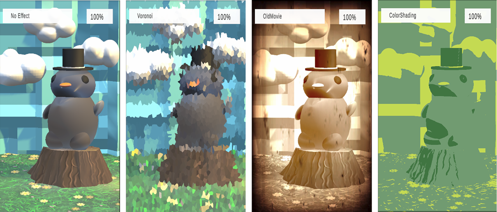

# Non-realistic Visualization on Autostereoscopic Displays

**Author:** Aneta Chalivopulosová

**Master's Thesis at FIT VUT, Brno 2026**

This master’s thesis researches non-realistic visualization methods for autostereoscopic displays. The thesis aims to evaluate how well non-realistic effects work on the Looking Glass Go display, focusing on the
functionality of the effects, preservation of 3D depth, quality, and user-friendliness. To do so, an app for the
Looking Glass Go display is created in the Unity Engine containing the implementation of over twenty effects,
two scenes and user interface. The effects include edge detection, different types of dithering and shading
methods, thresholding, distortion, and effects mimicking, for example, old movies, or night vision.

The thesis was presented at the Excel@FIT 2026 conference and received an award. Details can be found at the conference website: https://excel.fit.vutbr.cz/ and presented poster, abstract and video are placed in the folder named *Excel@FIT*.

## How to set up the project

- Download the project and open in Unity editor version 6, open scene "EffectsScene" from *Scenes* folder. Select preferred desktop build option (macOS, Linux, or Windows) and build the app. 

- Or download one of the available releases (macOS, Windows). 

The app requires a Looking Glass display and is created for the Looking Glass Go display specifically (available at: https://lookingglassfactory.com/products-collection/looking-glass-go). To use this display with your computer, first install *Looking Glass Bridge*, information about the installation and use is available at the official Looking Glass website: https://lfdocs.lookingglassfactory.com/software/looking-glass-bridge. 

After successful installation plug the display into your computer, turn the display on and switch to *desktop mode* (see: https://lfdocs.lookingglassfactory.com/getting-started/looking-glass-go/get-started-with-looking-glass-go). After this step, the display is ready to be used and you can open the built app. 

## How to use the app

The app contains two scenes (one static and one with the option of movement) and the implementation of 22 effects (shaders) that can be turned on. You can also control the intensity of each effect. When first opened, you will see the first scene with no effect turned on. The app is controlled via keys on a keyboard, see table (**Table 1**) below for more information. The final app is shown below (**Image 1**).

| Key | Action |
| :--- | :--- |
| N | Switch to the next effect in sequence. |
| P | Switch to the previous effect in sequence. |
| R | Toggle intensity between 0% and previous value. |
| F | Toggle intensity between 100% and previous value. |
| X | Toggle between holographic 3D and classic 2D display modes. |
| Left CONTROL | Reset the entire application. |
| Left Arrow ← | Decrease effect intensity by 5%. |
| Right Arrow → | Increase effect intensity by 5%. |
| Tab | Switch between scenes. |
| W-S-A-D | Movement in the second scene – forward-backward-left-right. |

**Table 1:** Key-to-action mapping. The application utilizes keyboard controls to ensure a minimal number of distracting elements (buttons, sliders, etc.) on the small screen of the Looking Glass Go display.

**Image 1:** The final look of the app with 3 out of 22 effects. From left, app with no effect turned on, Voronoi effect, Old Movie effect, and Color Shading effect.

## Contents of the project

The **Assets** folder contains most of the important parts of the project - *Shaders*, *Scripts*, *Materials*, *Textures*. The resources are always mentioned the code itself, or in a text file ending with "*_sources.txt*".

**Shaders folder** contains implementation of 24 shaders and their materials, either done in HLSL, or Shader Graph. 22 of these effects can be turned on in the app.

- *The 24 shaders are*: Ascii, ColorShading, DepthVisualization, Distortion, Dithering, DotShading, Grunge, InvertColors, MatrixDith, NightVision, OldMovie, OutlineFull, OutlineOnly, PinkShades, Pixelated, RandomDither, RevealNormals, StripeShading, Swirl, SwirlBlackAndWhite, Thresholding, Voronoi, Wobble, Wobble2

**Scripts folder** contains all the scripts used for controlling the app and the effects. The scripts are: 

- *CustomEffectFeature.cs*: used to inject post-processing effects into the pipeline (Scriptable Renderer Feature)
- *IntensitySlider.cs*: used to change the intensity of the effect by adding or subtracting 5% (left and right arrow keys actions)
- *PreviousNextBtn.cs*: used to switch to next or previous effect in sequence (N, P keys actions),
- *ResetAllEffects.cs*: used to reset all effects to 100% intensity and switch to no effect (Left CONTROL key action),
- *ResetSwitchBtn.cs*: used to switch between 100% and 0% intensity and switching between 3D and 2D on the display (R, F and X keys actions),
- *SwitchScenesBtn.cs*: used for switching between the scenes on user's input (Tab key action).

**Materials folder** contains materials used for objects in the scene. All objects were created either in Unity Editor, or Blender by the author of this thesis.

**Textures folder** contains textures used for objects, or shaders. All the resources are mentioned in a text file in this folder.
